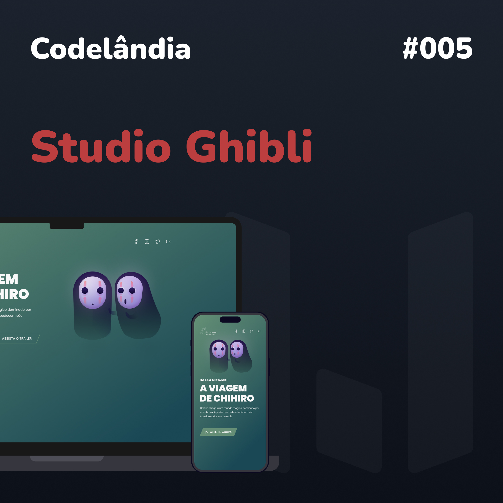

<h1 align="center">{nome do desafio} por <b>Codelândia</b></h1>

  <a href="#-tecnologias">Tecnologias</a>&nbsp;&nbsp;&nbsp;|&nbsp;&nbsp;&nbsp;
  <a href="#-projeto">Projeto</a>&nbsp;&nbsp;&nbsp;|&nbsp;&nbsp;&nbsp;
  <a href="#-layout">Layout</a>&nbsp;&nbsp;&nbsp;|&nbsp;&nbsp;&nbsp;

 

  

## 🚀 Tecnologias

Esse projeto foi desenvolvido com as seguintes tecnologias:

- HTML
- CSS
- React
- Typescript

## 💻 Projeto

Desafio proposto pela comunidade Codelândia do [@iuricode](https://iuricode.com/)!

## 🔖 Layout

Você pode visualizar os desafios através [DESSE LINK](https://www.figma.com/file/Yb9IBH56g7T1hdIyZ3BMNO/Desafios---Codel%C3%A2ndia?t=NlA3cWmOsynNudlP-7).
